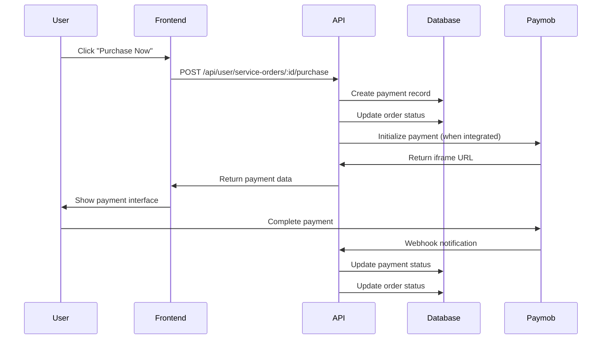

# 🛒 ICSRT++ Service Purchase System - Complete Integration Guide

## 🎯 System Overview

The ICSRT++ Service Purchase System is a comprehensive e-commerce solution designed for purchasing confirmed service orders. It includes:

- **Purchase Flow Management**: Full user purchase journey
- **Coupon System**: Percentage and fixed discount coupons
- **Payment Integration**: Ready for Paymob API integration
- **Billing Management**: Customer billing information collection
- **Payment Tracking**: Complete payment history and status tracking

## 🏗️ Architecture

### Backend Components

1. **service-order-purchase-api.js** - Main purchase API endpoints
2. **paymob-integration-template.js** - Paymob integration template
3. **enhanced-service-orders-api-simple.js** - Enhanced order management
4. **Database Collections**:
   - `service-orders` - Order data with purchase status
   - `payments` - Payment records and transaction history
   - `coupons` - Discount coupon management

### Frontend Components

1. **UserServiceOrdersNew.jsx** - Enhanced with purchase functionality
2. **Purchase Tab** - Integrated purchase interface in order modal
3. **Coupon Validation** - Real-time coupon code validation
4. **Billing Form** - Customer billing information collection

## 🚀 Quick Start

### 1. Setup and Start System

```bash
# Start the complete purchase system
start-purchase-system.bat

# Or manually:
cd icsrt-db
npm install
node create-purchase-test-data.js
npm start
```

### 2. Test User Credentials

- **Email**: `testuser@icsrt.com`
- **Test Coupon Codes**:
  - `WELCOME10` - 10% discount
  - `SAVE50` - $50 off orders above $200
  - `EARLY20` - 20% discount

### 3. Test Purchase Flow

1. Login to user page: http://localhost:3002
2. Navigate to Service Orders
3. Look for orders with "Ready for payment" status
4. Click "Purchase Now" button
5. Apply coupon codes and complete purchase

## 📋 API Endpoints

### Purchase Management

```javascript
// Initiate purchase
POST /api/user/service-orders/:id/purchase
{
  "userEmail": "user@example.com",
  "paymentMethod": "paymob",
  "billingInfo": { ... },
  "couponCode": "WELCOME10",
  "currency": "USD"
}

// Check payment status
GET /api/user/payments/:paymentId/status?userEmail=user@example.com

// Get payment history
GET /api/user/payments?userEmail=user@example.com

// Validate coupon
POST /api/user/coupons/validate
{
  "couponCode": "WELCOME10",
  "orderAmount": 100
}

// Paymob webhook (for payment completion)
POST /api/webhooks/payment/paymob
```

## 🎫 Coupon System

### Coupon Structure

```javascript
{
  "_id": ObjectId,
  "code": "WELCOME10",
  "description": "Welcome offer - 10% discount",
  "discountType": "percentage", // or "fixed"
  "discountValue": 10,
  "minimumAmount": 50,
  "isActive": true,
  "usageLimit": 100,
  "usedCount": 5,
  "expiresAt": "2024-08-15T00:00:00Z"
}
```

### Usage Examples

- **Percentage Discount**: `discountType: "percentage", discountValue: 15` = 15% off
- **Fixed Discount**: `discountType: "fixed", discountValue: 50` = $50 off

## 💳 Payment Flow

### 1. Order Status Requirements

Orders must have one of these statuses to be purchasable:
- `status: "confirmed"`
- `status: "ready-for-payment"`

And payment status must be:
- `paymentStatus: "pending"` or not set

### 2. Purchase Process



### 3. Payment Record Structure

```javascript
{
  "_id": ObjectId,
  "orderId": ObjectId,
  "orderNumber": "ORD-2024-001",
  "userEmail": "user@example.com",
  "amount": 450,
  "originalAmount": 500,
  "currency": "USD",
  "paymentMethod": "paymob",
  "paymentStatus": "completed",
  "appliedCoupon": {
    "code": "WELCOME10",
    "discountAmount": 50
  },
  "billingInfo": { ... },
  "paymobData": {
    "transaction_id": "TXN-123",
    "order_id": "PMB-456"
  },
  "createdAt": "2024-07-26T10:00:00Z",
  "completedAt": "2024-07-26T10:05:00Z"
}
```

## 🔌 Paymob Integration

### Environment Variables Required

```bash
PAYMOB_API_KEY=your_api_key_from_paymob_dashboard
PAYMOB_INTEGRATION_ID=your_integration_id
PAYMOB_IFRAME_ID=your_iframe_id
PAYMOB_HMAC_SECRET=your_hmac_secret
```

### Integration Steps

1. **Setup Paymob Account**:
   - Create account at https://accept.paymob.com/
   - Get API credentials from Dashboard > Developers
   - Setup webhook URL: `https://yourdomain.com/api/webhooks/payment/paymob`

2. **Install Dependencies**:
   ```bash
   npm install axios crypto
   ```

3. **Update Purchase API**:
   ```javascript
   // Import Paymob integration
   const PaymobIntegration = require('./paymob-integration-template');
   const paymob = new PaymobIntegration();
   
   // In purchase endpoint:
   const paymentResult = await paymob.initiatePayment(orderData, billingInfo);
   if (paymentResult.success) {
     // Return iframe URL to frontend
     res.json({
       success: true,
       paymentUrl: paymentResult.iframeUrl,
       // ... other data
     });
   }
   ```

4. **Frontend Integration**:
   ```javascript
   // Redirect to payment URL or show in iframe
   if (data.paymentUrl) {
     window.open(data.paymentUrl, '_blank');
     // Or embed iframe in modal
   }
   ```

## 🎨 Frontend Features

### Purchase Interface

The purchase system adds these UI components:

1. **Purchase Button**: Shows on confirmed orders
2. **Purchase Tab**: In order details modal
3. **Coupon Input**: Real-time validation
4. **Billing Form**: Customer information collection
5. **Payment Summary**: Order total with discounts
6. **Status Indicators**: Visual payment status

### Purchase Tab Components

- **Order Summary**: Service name, amounts, discounts
- **Payment Method**: Paymob gateway information
- **Coupon Code**: Input with validation feedback
- **Billing Information**: Required customer details
- **Purchase Button**: Final payment initiation

## 🧪 Testing

### Test Data Available

1. **Confirmed Orders**: Ready for purchase
2. **Sample Coupons**: Various discount types
3. **Payment Records**: Historical data examples

### Test Scenarios

1. **Successful Purchase**: Complete flow with valid data
2. **Coupon Application**: Test different coupon types
3. **Validation Errors**: Missing billing info, invalid coupons
4. **Payment Success/Failure**: Webhook handling

### Test Commands

```bash
# Create test data
node create-purchase-test-data.js

# Start system with test data
start-purchase-system.bat

# Test API endpoints
curl -X POST http://localhost:3000/api/user/coupons/validate \
  -H "Content-Type: application/json" \
  -d '{"couponCode":"WELCOME10","orderAmount":100}'
```

## 🔒 Security Features

### Payment Security

- **Webhook Signature Verification**: Validates Paymob webhooks
- **Input Validation**: All user inputs validated
- **Rate Limiting**: Prevents abuse of payment endpoints
- **Transaction Logging**: All payments logged for audit

### Data Protection

- **User Email Validation**: Ensures user owns orders
- **Billing Data Encryption**: Sensitive data protection
- **Payment Status Tracking**: Prevents double payments
- **Coupon Usage Limits**: Prevents coupon abuse

## 📊 Admin Management

### Order Status Management

Admins can update order status to make them purchasable:

```javascript
// Update order to confirmed status
PUT /api/admin/service-orders/:id/status
{
  "status": "confirmed",
  "reason": "Order reviewed and approved for purchase"
}
```

### Coupon Management

Create and manage discount coupons:

```javascript
// Create new coupon
POST /api/admin/coupons
{
  "code": "NEWUSER25",
  "description": "25% off for new users",
  "discountType": "percentage",
  "discountValue": 25,
  "minimumAmount": 100,
  "usageLimit": 50,
  "expiresAt": "2024-12-31T23:59:59Z"
}
```

## 🚀 Production Deployment

### Pre-Launch Checklist

- [ ] Paymob API credentials configured
- [ ] Webhook URL setup and tested
- [ ] SSL certificate installed
- [ ] Payment flow tested end-to-end
- [ ] Error handling verified
- [ ] Security audit completed
- [ ] Backup procedures in place

### Environment Setup

```bash
# Production environment variables
NODE_ENV=production
PAYMOB_API_KEY=live_api_key
PAYMOB_INTEGRATION_ID=live_integration_id
PAYMOB_IFRAME_ID=live_iframe_id
PAYMOB_HMAC_SECRET=live_hmac_secret
MONGODB_URI=mongodb+srv://...
```

## 📈 Analytics & Monitoring

### Key Metrics to Track

- **Purchase Conversion Rate**: Orders purchased vs confirmed
- **Coupon Usage**: Most popular discount codes
- **Payment Success Rate**: Successful vs failed payments
- **Average Order Value**: With and without coupons
- **User Purchase Behavior**: Repeat vs new customers

### Monitoring Setup

- **Payment Webhook Logs**: Monitor Paymob callbacks
- **Error Rate Tracking**: Purchase and payment failures
- **Performance Metrics**: API response times
- **Security Alerts**: Suspicious payment activity

## 🆘 Troubleshooting

### Common Issues

1. **Order Not Purchasable**:
   - Check order status is 'confirmed' or 'ready-for-payment'
   - Verify paymentStatus is not already 'paid'

2. **Coupon Not Working**:
   - Check coupon is active and not expired
   - Verify minimum amount requirements
   - Check usage limits not exceeded

3. **Payment Failure**:
   - Verify Paymob credentials are correct
   - Check webhook URL is accessible
   - Monitor Paymob dashboard for errors

4. **Webhook Issues**:
   - Verify HMAC signature validation
   - Check webhook URL returns 200 status
   - Monitor webhook logs for errors

## 📞 Support & Maintenance

### Regular Maintenance Tasks

- **Monitor Payment Status**: Check for stuck payments
- **Update Coupon Expiry**: Remove expired coupons
- **Review Failed Payments**: Investigate failures
- **Backup Payment Data**: Regular data backups
- **Security Updates**: Keep dependencies updated

### Contact Information

For support with the purchase system:
- **Technical Issues**: Check logs and error messages
- **Paymob Integration**: Refer to Paymob documentation
- **Database Issues**: Check MongoDB connection and queries

---

## 🎉 Ready for Production!

The ICSRT++ Service Purchase System is now fully implemented and ready for Paymob API integration. The system provides:

✅ **Complete Purchase Flow**: From order confirmation to payment completion  
✅ **Flexible Coupon System**: Support for various discount types  
✅ **Secure Payment Processing**: Ready for Paymob integration  
✅ **User-Friendly Interface**: Intuitive purchase experience  
✅ **Admin Management**: Order and coupon management tools  
✅ **Comprehensive Testing**: Full test data and scenarios  

**Next Step**: Configure Paymob API credentials and go live! 🚀
